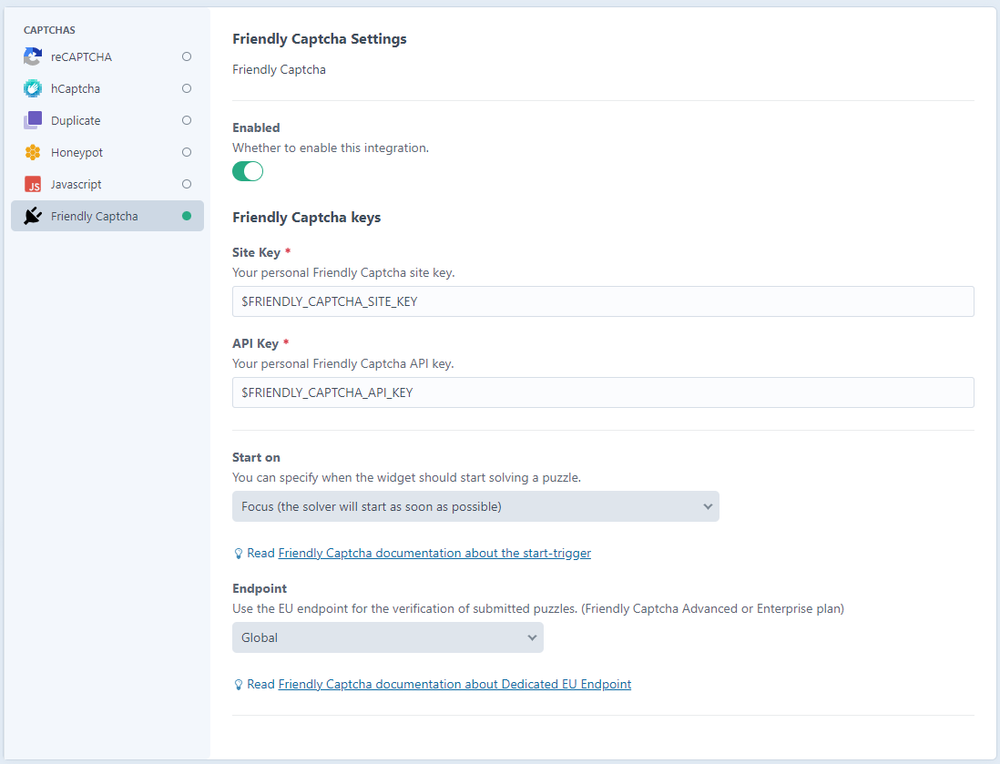

# Friendly Captcha integration for Formie


## Requirements

This plugin requires Craft CMS 3.x or Craft CMS 4.x.

## Installation

To install the plugin, follow these instructions.

1. Open your terminal and go to your Craft project:

       cd /path/to/project

2. Then tell Composer to load the plugin:

       composer require digitalpulsebe/craft-formie-friendly-captcha

   when using Craft 3.x use plugin version 1:

       composer require digitalpulsebe/craft-formie-friendly-captcha:^1.0.0

3. In the Control Panel, go to Settings → Plugins and click the “Install” button for Friendly Captcha. Or run:

       php craft plugin/install formie-friendly-captcha

## Friendly Captcha keys

Create an account for Friendly Captcha [https://friendlycaptcha.com/](https://friendlycaptcha.com/)

Generate a **sitekey** and an **API key** and put them in the plugin settings or .env-file

## Configuring Friendly Captcha

Find the settings under Formie > Settings > Captchas > Friendly Captcha



## Formie unload warning

Friendly Captcha will update the content of the form, 
it will trigger a javascript alert "Changes you made may not be saved." when leaving the page.
[Read Formie configuration documentation](https://verbb.io/craft-plugins/formie/docs/get-started/configuration)

To avoid this, use this option in config/formie.php:

```php
[ 
  'enableUnloadWarning' => false,
]
```

## Friendly Captcha for other uses

Install the [Friendly Captcha](https://github.com/digitalpulsebe/craft-friendly-captcha) plugin to use Friendly Captcha outside of Formie.
